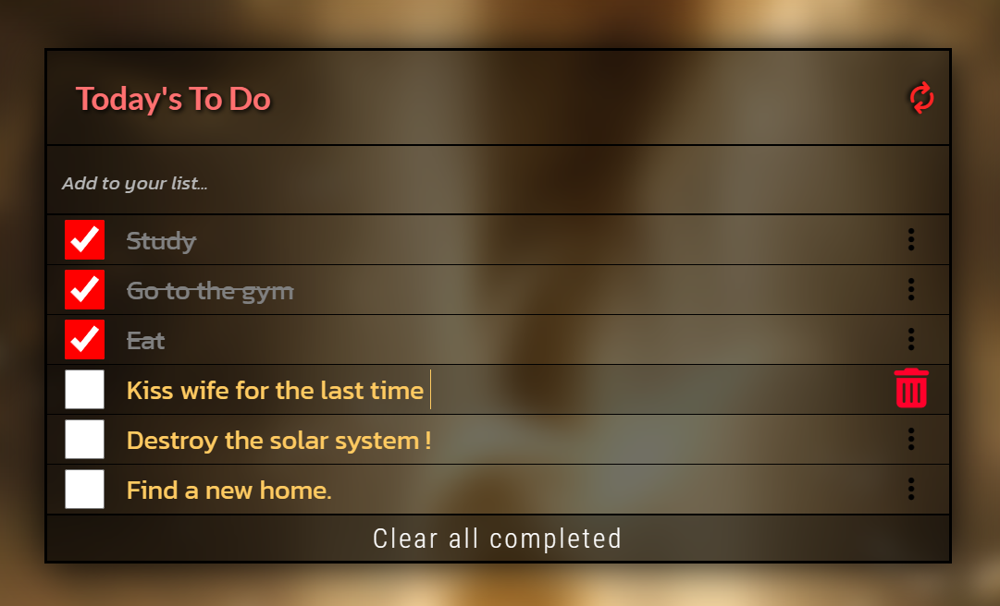

<h1 align="center">To Do List</h1>

<p align="center">
  <a href="https://github.com/chawkimbarki">
    
  </a>
  <a href="https://twitter.com/Chawki__Mbarki">
    
  </a>
  <a href="https://www.linkedin.com/in/chawki-mbarki-a77546202/">
    
  </a>
</p>

<p align="center">
  <strong>A simple To Do List app that allows you to create and manage your tasks.</strong>
  <br>
  You can add new tasks, mark them as completed or delete them. You can also drag and drop the tasks to reorder them according to your preference.
</p>
<div align="center">

</div>

<hr>

## Table of Contents

- [🛠 Built With](#built-with)
- [Key Features](#key-features)
- [🚀Live Demo](#live-demo)
- [💻Getting Started](#getting-started)
  - [Prerequisites](#prerequisites)
  - [Setup](#setup)
  - [Install](#install)
  - [Usage](#usage)
  - [Run tests](#run-tests)
  - [Deployment](#deployment)
- [👥Author](#author)
- [🔭Future Features](#Future-Features)
- [🤝Contributing](#contributing)
- [⭐️Show your support](#show-your-support)
- [🙏Acknowledgments](#acknowledgments)
- [📝License](#license)

<hr>

## 🛠 Built With

- HTML
- CSS
- JavaScript
- Webpack

## Key Features
- A simple and intuitive user interface that allows you to add, edit, delete, and mark tasks as completed.
- A local storage system that saves your tasks and preserves their status even after closing the browser.
- A drag and drop functionality that lets you reorder your tasks according to your preference.
- A clear all button that removes all the completed tasks from the list.

## 🚀 Live Demo

[Live Demo Link](https://chawkimbarki.github.io/Todo/dist/index.html)

## 💻 Getting Started

To get a local copy up and running follow these simple steps:

### Prerequisites

- [Git](https://git-scm.com)
- [Node.js](https://nodejs.org/en/download/)
- [npm](http://npmjs.com)

### Setup

- Clone this repository using 
```bash
git clone https://github.com/chawkimbarki/Todo.git
```
- Navigate to the project folder using
```bash
cd Todo
```

## Install

- Install the dependencies using
```bash
npm install
```

## Usage

- Run the app in development mode using
```bash
npm run start
```
- Open your browser and go to http://localhost:8080/ to see the app

## Run tests

- Run the tests using
```bash
npm run test
```

## Deployment

- To build the app for production, run
```bash
npm run build
```
- The output files will be in the dist folder

## Author

👤 Chawki Barki

- GitHub: [@chawkimbarki](https://github.com/chawkimbarki)
- Twitter: [@Chawki__Mbarki](https://twitter.com/Chawki__Mbarki)
- LinkedIn: [Chawki Mbarki](https://www.linkedin.com/in/chawki-mbarki-a77546202/)

## 🔭 Future Features

- A filter option that lets you view only the completed or the pending tasks.
- A date picker that lets you set deadlines for your tasks and reminds you of the upcoming ones.
- A dark mode that changes the color scheme of the interface to reduce eye strain.
- A login system that lets you sync your tasks across different devices.

## 🤝 Contributing

Contributions, issues, and feature requests are welcome!

Feel free to check the issues page.

## Show your support

Give a ⭐️ if you like this project!

## Acknowledgments

- The project was inspired by this [website](https://web.archive.org/web/20180320194056/http://www.getminimalist.com:80/)
- The icons were taken from [Font Awesome](https://fontawesome.com/)
- The fonts were taken from [Google Fonts](https://fonts.google.com/)

📝 License
This project is MIT licensed.
